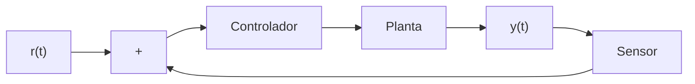
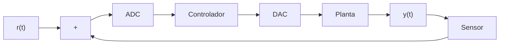
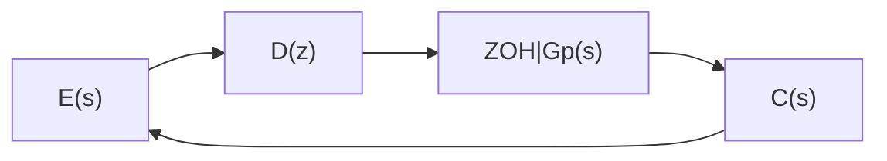

## Controle Digital

### Elementos de um sistema de controle

- Sistema ou planta: que é o elemento ou fenômeno físico que
se deseja controlar;
- Sensores: elementos capazes de medir o estado do sistema.
Provêem as saídas sobre as quais imprime-se o comportamento
desejado;
- Referência: que é o perfil físico desejado para uma determinada saída;
- Atuadores: elementos físicos que geram a ação de controle sobre o sistema. São eles que transformam as ordens matemáticas do controlador em ações efetivas sobre o sistema;
- Controlador: elemento que – baseado em leis e critérios específicos – calcula a ação de controle necessária para que a saída do sistema se aproxime do perfil desejado. 
**O projeto do controlador passa pela avaliação de vários critérios de desempenho, entre eles:**
 - estabilidade;
 - resposta transitória;
 - erro em estado estacionário;
 - rejeição a perturbações externas;
 - robustez a variações dos parâmetros e erros de modelagem.

### Visão Geral de um sistema de controle digital

### E8
 **Quase nunca a taxa de amostragem de um sistema de controle digital (no máximo de algumas centenas de Hz) será da mesma ordem do clock do respectivo sistema microprocessado (de milhões a bilhões de Hz). Por que?**

 A taxa de amostragem de um sistema de controle digital é muito menor que a frequência de clock de um microprocessador por vários motivos fundamentais, entre eles:

1. Princípio da Amostragem e Resolução do Sistema
A taxa de amostragem precisa ser suficiente para capturar a dinâmica do sistema controlado, seguindo o Teorema de Nyquist-Shannon. No entanto, sistemas de controle geralmente operam em baixas frequências (algumas dezenas ou centenas de Hz), pois as variáveis físicas envolvidas (temperatura, velocidade, posição, etc.) mudam relativamente devagar. Por outro lado, o clock do microprocessador é altíssimo (MHz a GHz) porque ele precisa processar muitas operações em paralelo e realizar cálculos rapidamente, mas isso não significa que a taxa de amostragem do controle precise ser tão alta.

2. Latência e Tempo de Processamento
Em um sistema de controle digital, cada amostra coletada precisa ser processada antes que a próxima seja adquirida. Isso inclui leitura de sensores, processamento do algoritmo de controle (por exemplo, um controlador PID) e envio do sinal de controle para o atuador. Se a taxa de amostragem fosse próxima ao clock do processador, o tempo disponível para processar cada amostra seria extremamente pequeno, impossibilitando cálculos complexos e a comunicação com sensores e atuadores.

3. Limitações Físicas e de Comunicação
Sensores e atuadores físicos possuem tempos de resposta limitados. Mesmo que o processador possa operar em GHz, um sensor de temperatura ou um motor não responde a mudanças em microssegundos. Além disso, sistemas embarcados frequentemente usam barramentos de comunicação (I2C, SPI, UART, etc.) que possuem velocidades limitadas, impedindo uma aquisição de dados na mesma taxa do clock do processador.

4. Eficiência Energética e Recursos Computacionais
Executar um sistema de controle com uma taxa de amostragem muito alta aumentaria o consumo de energia e a carga de processamento desnecessariamente.O tempo entre amostras é muitas vezes usado para executar outras tarefas do sistema embarcado, como comunicação, diagnóstico ou atualizações de estado.

Conclusão
A taxa de amostragem de um sistema de controle digital é projetada para ser compatível com a dinâmica do sistema físico controlado, enquanto a frequência de clock do microprocessador é otimizada para processamento eficiente e rápido de múltiplas tarefas. Como resultado, a taxa de amostragem de controle geralmente é de algumas centenas de Hz, enquanto o clock do processador está na faixa de MHz a GHz.
---

### E12

Aparentemente o amostrador que é conversor analógico digital está depois do somador

### Amostrador Ideal
 $$r^*(t) = \sum_{k=0}^{\infty} r(kT_S)\, \delta(t - kT_S)$$

### Retentor de ordem Zero (ZOH)
**Note:** Para cada intervalo de amostragem, a saída do ZOH é dada pelo sinal amostrado no tempo kTs (r(kTs)), multiplicado pelo sinal pulso unitário de duração Ts:

$$
p(t,T_s) =
\begin{cases}
0, & \text{para } t < 0 \\
1, & \text{para } 0 \leq t \leq T_s \\
0, & \text{para } t > T_s
\end{cases}
$$

Em que o degrau unitário pode ser escrito como a subtração de dois degraus unitários:
$$
p(t, T_S) = u(t) - u(t - T_S)
$$

Aplicando a transformada de Laplace:
$$
ZOH(s) = \mathcal{L}\{p(t, T_S)\} = \mathcal{L}\{u(t) - u(t - T_S)\}
$$

$$
ZOH(s) = \frac{1}{s} - \frac{e^{-T_S s}}{s} = \frac{1 - e^{-T_S s}}{s}
$$

Fazendo $s = j\omega$, sendo o equivalente da transformada de Fourier:

No domínio da frequência:
$$
ZOH(j\omega) = \frac{1-e^{-jT_s\omega}}{j\omega}
$$

#### Formula Fechada
$$
R^*(s) = \sum_{\text{nos polos de } R(\lambda)} \text{Res} \{ R(\lambda) \cdot \frac{1}{1 - e^{-T_S(s - \lambda)}} \}
$$

### Configurações de Sistemas e Funções de Transferência

#### (a) Sistema com Amostragem em Cascata

$$
C(z) = G_1(z)G_2(z)E(z)
$$

#### (b) Sistema com Amostragem Única

$$
C(z) = \mathcal{Z}\{G_1(s)G_2(s)\}E(z)
$$

#### (c) Sistema com Amostragem Intermediária

$$
C(s) = G_2(s)A^*(s)
$$
$$
C(z) = G_2(z)\mathcal{Z}\{G_1(s)E(s)\}
$$

#### (d) Sistema com ZOH

$$
C(z) = E(z)D(z)(\frac{z-1}{z})\mathcal{Z}\{\frac{G_p(s)}{s}\}
$$

### Atraso de tempo nos sistemas contínuos

Em um sistema contínuo com atraso, a medição obtida no tempo atual $t_0$ ($y(t = t_0)$) é resultante de uma entrada aplicada em um instante de tempo $T_a$ anterior ($u(t = t_0 - T_a)$).

Matematicamente, no instante atual $t$, temos $u(t)$ e $y(t - T_a)$. Aplicando o teorema da translação real de Laplace, temos:

$$
\mathcal{L}\{y(t-T_a)u(t-T_a)\} = e^{-T_as}Y(s)
$$

Então, um sistema contínuo com atraso de tempo é escrito como:

$$
\frac{Y(s)}{U(s)} = G(s)e^{-T_as}
$$

onde $G(s)$ é a função de transferência que define a física do processo e $T_a$ é o atraso de transporte do sistema.

## Mapeamento do plano s no plano z

### Relembrando alguns fatos

- Já sabemos que a relação entre as variáveis s e z se faz pela fórmula:
$$
z = e^{sT_s}
$$

- Sabemos também da propriedade de periodicidade da amostragem que basta considerar a região do plano s limitada por $\omega = \pm\omega_s/2$. Os polos que aparecem nesta região são replicados fora desta faixa.

- Por fim, sabemos que a relação unívoca entre os planos s e z só é válida para os polos; Nada pode ser afirmado com relação aos zeros.

### Mapeando o eixo imaginário

Primeiro, note que:
$$
z = e^{sT_s} = e^{(\sigma+j\omega)T_s}
$$

Mas $\sigma = 0$ sobre o eixo imaginário, então:
$$
z = e^{j\omega T_s} = \cos(\omega T_s) + j\sen(\omega T_s) = 1\angle\omega T_s
$$

Portanto, o eixo imaginário no plano s (restrito na faixa $-\omega_s/2 \leq \omega \leq \omega_s/2$) é visto como o círculo unitário no plano z.

### Mapeando os limites da faixa primária

Se há um polo exatamente sobre uma das faixas primárias:
$$
z = e^{\sigma T_s\pm j\omega_s/2}
$$

Mas $\omega_s = 2\pi/T_s$, então $T_s\omega_s/2 = \pi$

Então:
$$
z = e^{\sigma T_s}\angle\pi
$$

Como $\sigma < 0$, um polo sobre um dos limites da faixa primária será mapeado sobre o eixo real esquerdo do plano z com parte real menor que 1.

### Mapeando um eixo vertical paralelo ao eixo imaginário

Tomemos agora um polo sobre um eixo vertical no plano s, paralelo ao eixo imaginário. Neste caso:
$$
z = e^{\sigma_1 T_s}e^{j\omega T_s}
$$
para algum $\sigma_1 \in \mathbb{R}$ com $-\omega_s/2 \leq \omega \leq \omega_s/2$

Então:
$$
z = e^{\sigma_1 T_s}\angle\omega T_s
$$

Ou seja, um eixo vertical no plano s é mapeado como um círculo no plano z. Se $\sigma_1 < 0$, este círculo tem raio menor que 1. Se $\sigma_1 > 0$, este círculo tem raio maior que 1.

### Estabilidade no plano z

Note que um polo instável no plano s ($\sigma_1 > 0$) será mapeado fora do círculo unitário no plano z, enquanto um polo estável no plano s ($\sigma_1 < 0$) será mapeado dentro do círculo unitário no plano z.

**Propriedade (Estabilidade)**: O círculo unitário delimita a região de estabilidade de polos no plano z. Se um polo neste plano estiver no interior do círculo unitário, este polo será estável. Se um polo neste plano estiver no exterior do círculo unitário, este polo será instável.

### Mapeando um eixo horizontal paralelo ao eixo real

Tomemos agora um polo sobre um eixo horizontal no plano s, paralelo ao eixo real. Neste caso:
$$
z = e^{\sigma T_s}e^{j\omega_1 T_s}
$$
para algum $-\omega_s/2 \leq \omega_1 \leq \omega_s/2$ e $\sigma \in \mathbb{R}$ com $-\infty < \sigma < \infty$

Então:
$$
z = e^{\sigma T_s}\angle\omega_1 T_s
$$

Isso equivale a um eixo-vetor no plano z, partindo de sua origem, com módulo $e^{\sigma T_s}$ e ângulo $\omega_1 T_s$.

### Mapeando um eixo-vetor

Por fim, considere um eixo-vetor no plano s, partindo de sua origem, com amplitude $\sigma_1$ e ângulo $\beta$. Neste caso:
$$
\frac{\omega}{\sigma_1} = \text{tg}(\beta)
$$

Então:
$$
z = e^{sT_s} = e^{\sigma_1 T_s}\angle\sigma_1 T_s\text{tg}(\beta)
$$
que é uma espiral logarítmica decrescente com o aumento de $\sigma_1$, $\sigma_1 < 0$.

## Transformação Bilinear

### Aproximação de $e^{sT_s}$

Já vimos que a relação entre os domínios s e z se faz através da relação:
$$
z = e^{sT_s}
$$

A fórmula acima, entretanto não é útil quando estamos interessados em obter computacionalmente H(z) via uma expressão em H(s). O motivo é que $e^{sT_s}$ não é uma forma computacional fechada, e seu cálculo exige a solução de uma série infinita.

### Aproximação de Padé

Poderíamos usar a aproximação de Taylor para a exponencial. Entretanto, para funções complexas com polos e zeros, a aproximação de Padé fornece melhores resultados.

Assim, aproximamos:
$$
e^{-x} \approx \frac{1-\frac{x}{2}+\frac{x^2}{8}-\frac{x^3}{48}+\cdots}{1+\frac{x}{2}+\frac{x^2}{8}+\frac{x^3}{48}+\cdots}
$$

Se truncarmos a série em seu segundo termo, chegamos à aproximação de Padé de primeira ordem.

### Atraso de tempo em s

A primeira aplicação da aproximação de Padé é na expressão de um sistema contínuo com atraso de tempo. Por exemplo, o sistema:
$$
G(s) = \frac{2e^{-T_0s}}{s+2}
$$

pode ser aproximado como:
$$
G(s) \approx \frac{2}{s+2} \cdot \frac{1-(T_0/2)s}{1+(T_0/2)s}
$$

Note que esta aproximação implica em introdução de um polo estável adicional, mais um zero no semiplano direito de s.

### Análise da variável z

Se aplicarmos a aproximação de Padé de primeira ordem à variável z, notamos facilmente que:
$$
z = e^{sT_s} \approx \frac{2+T_ss}{2-T_ss}
$$

Se isolarmos a variável s, temos:
$$
s \approx \frac{2(z-1)}{T_s(z+1)}
$$

### Transformação bilinear

Ao par de relações:
$$
z \approx \frac{2+T_ss}{2-T_ss}, \quad s \approx \frac{2(z-1)}{T_sz+1}
$$

damos o nome de transformação bilinear entre as variáveis s e z.

Obviamente, esta transformação estabelece uma relação aproximada entre funções de transferência em s e z. Entretanto, se o tempo de amostragem adotado for suficientemente baixo face às dinâmicas envolvidas, esta aproximação pode ser bastante precisa.

### Exemplo de Transformação bilinear

Seja:
$$
G(s) = \frac{2}{s+2}
$$

Usando a transformação bilinear com $T_s = 0.01s$, temos:
$$
G(z) = \frac{2(z+1)}{202z-198}
$$

Note que agora, como estamos aproximando explicitamente o termo $e^{sT_s}$, não devemos incluir a ação do ZOH.

### Mapeamento bilinear

Para evitar confusão, vamos definir uma nova variável w, tal que:
$$
z = \frac{2+T_sw}{2-T_sw}, \quad w = \frac{2(z-1)}{T_sz+1}
$$

O que faremos é associar os diversos valores de z no seu plano aos possíveis valores de w.

### Consequências do mapeamento bilinear

- Já concluímos que o mapeamento da faixa primária do plano s se faz como um disco unitário no plano z;
- Acabamos de ver que a transformação bilinear mapeia o disco unitário no plano z como o semiplano esquerdo no plano w;
- Isso tem um impacto muito importante no projeto de controladores digitais: se o fizermos no plano w, poderemos utilizar todas as técnicas do controle clássico analógico que já aprendemos em Introdução ao Controle;
- Isso ocorre porque todas aquelas técnicas se baseiam nas características no plano s, características essas "reconstituídas" no plano w, via transformação bilinear.

