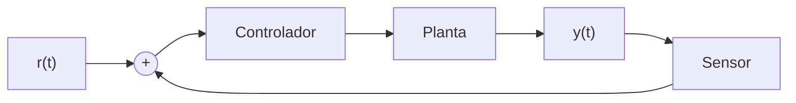
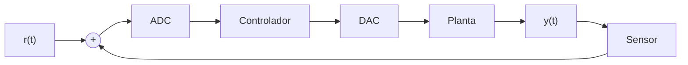
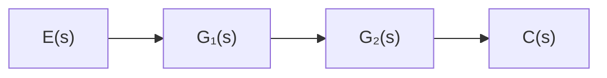
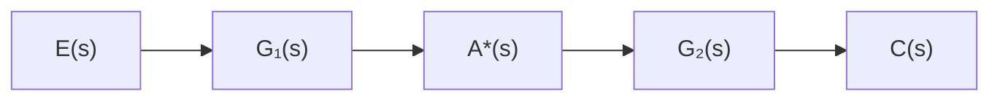
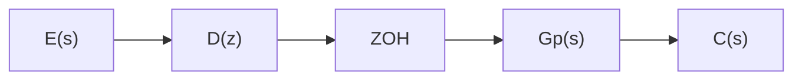

## Controle Digital

### Elementos de um sistema de controle

- Sistema ou planta: que é o elemento ou fenômeno físico que
se deseja controlar;
- Sensores: elementos capazes de medir o estado do sistema.
Provêem as saídas sobre as quais imprime-se o comportamento
desejado;
- Referência: que é o perfil físico desejado para uma determinada saída;
- Atuadores: elementos físicos que geram a ação de controle sobre o sistema. São eles que transformam as ordens matemáticas do controlador em ações efetivas sobre o sistema;
- Controlador: elemento que – baseado em leis e critérios específicos – calcula a ação de controle necessária para que a saída do sistema se aproxime do perfil desejado. 
**O projeto do controlador passa pela avaliação de vários critérios de desempenho, entre eles:**
 - estabilidade;
 - resposta transitória;
 - erro em estado estacionário;
 - rejeição a perturbações externas;
 - robustez a variações dos parâmetros e erros de modelagem.

### Visão Geral de um sistema de controle digital

### E8
 **Quase nunca a taxa de amostragem de um sistema de controle digital (no máximo de algumas centenas de Hz) será da mesma ordem do clock do respectivo sistema microprocessado (de milhões a bilhões de Hz). Por que?**

 A taxa de amostragem de um sistema de controle digital é muito menor que a frequência de clock de um microprocessador por vários motivos fundamentais, entre eles:

1. Princípio da Amostragem e Resolução do Sistema
A taxa de amostragem precisa ser suficiente para capturar a dinâmica do sistema controlado, seguindo o Teorema de Nyquist-Shannon. No entanto, sistemas de controle geralmente operam em baixas frequências (algumas dezenas ou centenas de Hz), pois as variáveis físicas envolvidas (temperatura, velocidade, posição, etc.) mudam relativamente devagar. Por outro lado, o clock do microprocessador é altíssimo (MHz a GHz) porque ele precisa processar muitas operações em paralelo e realizar cálculos rapidamente, mas isso não significa que a taxa de amostragem do controle precise ser tão alta.

2. Latência e Tempo de Processamento
Em um sistema de controle digital, cada amostra coletada precisa ser processada antes que a próxima seja adquirida. Isso inclui leitura de sensores, processamento do algoritmo de controle (por exemplo, um controlador PID) e envio do sinal de controle para o atuador. Se a taxa de amostragem fosse próxima ao clock do processador, o tempo disponível para processar cada amostra seria extremamente pequeno, impossibilitando cálculos complexos e a comunicação com sensores e atuadores.

3. Limitações Físicas e de Comunicação
Sensores e atuadores físicos possuem tempos de resposta limitados. Mesmo que o processador possa operar em GHz, um sensor de temperatura ou um motor não responde a mudanças em microssegundos. Além disso, sistemas embarcados frequentemente usam barramentos de comunicação (I2C, SPI, UART, etc.) que possuem velocidades limitadas, impedindo uma aquisição de dados na mesma taxa do clock do processador.

4. Eficiência Energética e Recursos Computacionais
Executar um sistema de controle com uma taxa de amostragem muito alta aumentaria o consumo de energia e a carga de processamento desnecessariamente.O tempo entre amostras é muitas vezes usado para executar outras tarefas do sistema embarcado, como comunicação, diagnóstico ou atualizações de estado.

Conclusão
A taxa de amostragem de um sistema de controle digital é projetada para ser compatível com a dinâmica do sistema físico controlado, enquanto a frequência de clock do microprocessador é otimizada para processamento eficiente e rápido de múltiplas tarefas. Como resultado, a taxa de amostragem de controle geralmente é de algumas centenas de Hz, enquanto o clock do processador está na faixa de MHz a GHz.
---

### E12

Aparentemente o amostrador que é conversor analógico digital está depois do somador

### Amostrador Ideal
 $$r^*(t) = \sum_{k=0}^{\infty} r(kT_S)\, \delta(t - kT_S)$$

### Retentor de ordem Zero (ZOH)
**Note:** Para cada intervalo de amostragem, a saída do ZOH é dada pelo sinal amostrado no tempo kTs (r(kTs)), multiplicado pelo sinal pulso unitário de duração Ts:

$$
p(t,T_s) = \begin{cases}
0, & t < 0 \\
1, & 0 \leq t \leq T_s \\
0, & t > T_s
\end{cases}
$$
 Em que o degrau unitario pode ser escrito como a subtração de dois degraus unitários
$$
p(t, T_S) = u(t) - u(t - T_S)
$$
Aplicando  A trasnformada de Laplace.
$$
ZOH(s) = \mathcal{L}\{p(t, T_S)\} = \mathcal{L}\{u(t) - u(t - T_S)\}
$$
$$
ZOH(s) = \frac{1}{s} - \frac{e^{-T_S s}}{s} = \frac{1 - e^{-T_S s}}{s}
$$
fazendo  s = $ \omega $ j  , sendoo equivalente da transformada de fourier

No domínio da frequência:
$$
ZOH(j\omega) = \frac{1-e^{-jT_s\omega}}{j\omega}
$$

#### Formula Fechada
$$
R^*(s) = \sum_{\text{nos polos de } R(\lambda)} \text{Res} \{ R(\lambda) \cdot \frac{1}{1 - e^{-T_S(s - \lambda)}} \}
$$

### Configurações de Sistemas e Funções de Transferência

#### (a) Sistema com Amostragem em Cascata

$$
C(z) = G_1(z)G_2(z)E(z)
$$

#### (b) Sistema com Amostragem Única

$$
C(z) = \mathcal{Z}\{G_1(s)G_2(s)\}E(z)
$$

#### (c) Sistema com Amostragem Intermediária

$$
C(s) = G_2(s)A^*(s)
$$
$$
C(z) = G_2(z)\mathcal{Z}\{G_1(s)E(s)\}
$$

#### (d) Sistema com ZOH

$$
C(z) = E(z)D(z)(\frac{z-1}{z})\mathcal{Z}\{\frac{G_p(s)}{s}\}
$$

### Atraso de tempo nos sistemas contínuos

Em um sistema contínuo com atraso, a medição obtida no tempo atual $t_0$ ($y(t = t_0)$) é resultante de uma entrada aplicada em um instante de tempo $T_a$ anterior ($u(t = t_0 - T_a)$).

Matematicamente, no instante atual $t$, temos $u(t)$ e $y(t - T_a)$. Aplicando o teorema da translação real de Laplace, temos:

$$
\mathcal{L}\{y(t-T_a)u(t-T_a)\} = e^{-T_as}Y(s)
$$

Então, um sistema contínuo com atraso de tempo é escrito como:

$$
\frac{Y(s)}{U(s)} = G(s)e^{-T_as}
$$

onde $G(s)$ é a função de transferência que define a física do processo e $T_a$ é o atraso de transporte do sistema.

